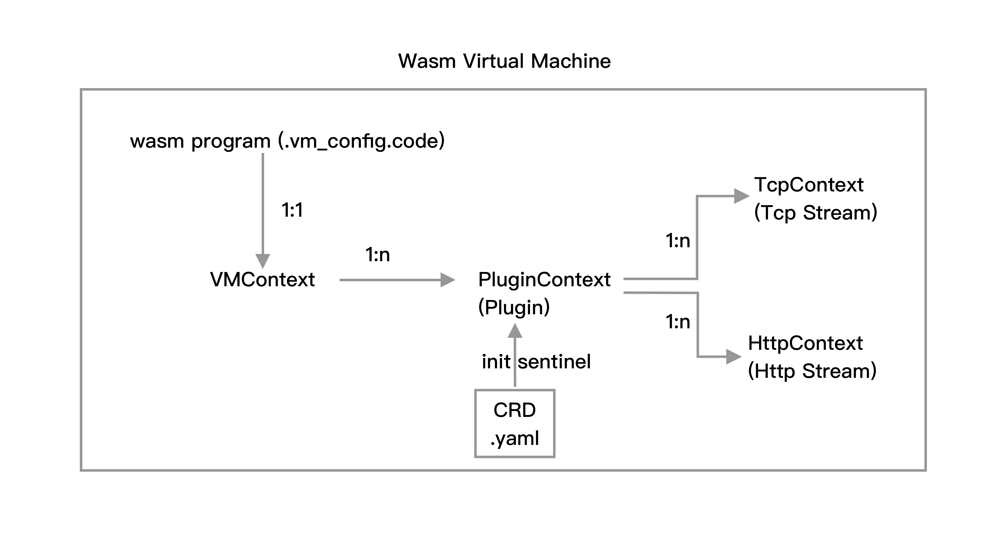
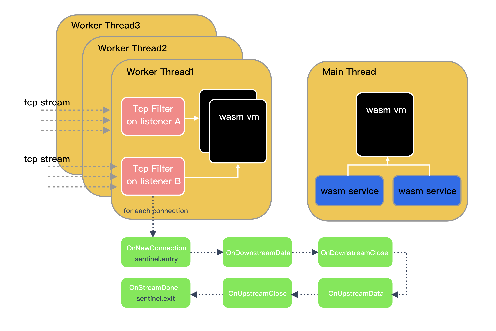

# sentinel-go-envoy-proxy-wasm
Sentinel Go Proxy-WASM extension


# Introduction

Due to the limitations of the sentinel token server for Envoy Global Rate Limiting Service model, scenarios and performance are limited. Considering the rapid development of cloud native in recent years, the voice of sentinel wasm extension in the community is getting higher and higher. Using the Envoy wasm extension and the native implementation of sentinel go, comprehensive traffic governance capabilities and standard coverage can be implemented.

# Environment and Tools

- tinygo 0.24.0 linux/amd64 (using go version go1.18.4 and LLVM version 14.0.0)
- func-e 1.1.3
- kubernetes/kubectl
- Istio
- Envoy

# How it works

The sentinel wasm extension implemented is based on the sentinel-go. So it uses proxy-wasm-go-sdk, which is an encapsulation of the Proxy-Wasm ABI, providing a series of APIs in the Go language. Using this SDK, it is possible to generate Wasm binaries that are compliant with the Proxy-Wasm.

Before discussing the wasm architecture design, let’s talk about the Wasm Virtual Machine (Wasm VM). Wasm VM is the environment for loading plugins. In Envoy, VMs are created in each thread and isolated from each other. So the wasm extension program we created will be copied into the thread created by Envoy and loaded on each VM. The Proxy-Wasm allows multiple plugins in a single VM. In other words, a VM can be used by multiple plugins.




From the vm loading timing, the thread first loads the vm, then the vm creates the context, and then loads the plugin context. The sentinel plugin is loaded by the vm. At this time, we can load some of the rule CRD specification yaml files we specified to perform the sentinel initialization operation. After the initial operation of sentinel plugin is completed, it starts to monitor http connection.



For each tcp connection, the plugin will intercept each upstream and downstream data packets. At this time, there are 5 hooks that can be executed. The entry is initialized when OnNewConnection is started, and the go statistical coroutine is started. Call the exit function at OnStreamDone and output a BlockError error message.

If there are operations such as current limiting and fusing in the process, a BlockError will be catched in OnUpstreamData, and this error message will be returned to the client. Each connection will trigger entry funciton. If it exits normally, it will trigger exit function, and if the limit traffic rule is triggered, it will return BlockError.

# Example

## How to run test client

The test client is used to control qps. That is, how many requests are requested per second.


```go
$ cd ./example
$ go build
$ ./client -q 100 -u some-test -p 8080
```

The client can receive 3 parameters, `q` is qps, the unit is per second, `u` is url path. `p` is port.


## How to run this Envoy Wasm Extensions 

We will be using [TinyGo](https://tinygo.org), [proxy-wasm-go-sdk](https://github.com/tetratelabs/proxy-wasm-go-sdk) and [func-e CLI](https://func-e.io) to build and test an Envoy Wasm extension. Then we'll show a way to configure the Wasm module using the EnvoyFilter resource and deploy it to Envoy sidecars in a Kubernetes cluster.

### Installing func-e CLI

Let's get started by downloading func-e CLI and installing it to `/usr/local/bin`:

```sh
curl https://func-e.io/install.sh | sudo bash -s -- -b /usr/local/bin
```

Once downloaded, let's run it to make sure all is good:

```sh
$ func-e --version
func-e version 1.1.3
```

### Installing TinyGo

TinyGo powers the SDK we'll be using as Wasm doesn't support the official Go compiler. 

Let's download and install the TinyGo:

```sh
wget https://github.com/tinygo-org/tinygo/releases/download/v0.24.0/tinygo_0.24.0_amd64.deb
sudo dpkg -i tinygo_0.24.0_amd64.deb
```

You can run `tinygo version` to check the installation is successful:

```sh
$ tinygo version
tinygo version 0.24.0 linux/amd64 (using go version go1.18.4 and LLVM version 14.0.0)
```

### Scaffolding the Wasm module

We'll start by creating a new folder for our extension, initializing the Go module, and downloading the SDK dependency:

```sh
$ mkdir header-filter && cd header-filter
$ go mod init header-filter
$ go mod edit -require=github.com/tetratelabs/proxy-wasm-go-sdk@main
$ go mod download github.com/tetratelabs/proxy-wasm-go-sdk
```

Next, let's create the `main.go` file where the code for our WASM extension will like this: [main.go](https://github.com/halfrost/sentinel-go-envoy-proxy-wasm/blob/sentinel-go/main.go)

Save the above contents to a file called `main.go`.

Let's build the filter to check everything is good:

```sh
tinygo build -o main.wasm -scheduler=none -target=wasi main.go
```

The build command should run successfully, and it should generate a file called `main.wasm`.

We'll use `func-e` to run a local Envoy instance to test the extension we've built.

First, we need an Envoy config that will configure the extension:

```yaml
static_resources:
  listeners:
    - name: tcp
      address:
        socket_address:
          address: 0.0.0.0
          port_value: 18000
      filter_chains:
        - filters:
            - name: envoy.filters.network.wasm
              typed_config:
                "@type": type.googleapis.com/envoy.extensions.filters.network.wasm.v3.Wasm
                config:
                  # Instruct that the PluginContext should behave as a Tcp filter.
                  configuration:
                    "@type": type.googleapis.com/google.protobuf.StringValue
                    value: |
                      {
                        "config_path": "./sentinel.yml",
                        "resource_name": "some-test"
                      }
                  # Use the same vm_config as above, so we can reuse the same VM for multiple queues.
                  vm_config:
                    vm_id: "sender"
                    runtime: "envoy.wasm.runtime.v8"
                    code:
                      local:
                        filename: "main.wasm"

            - name: envoy.tcp_proxy
              typed_config:
                "@type": type.googleapis.com/envoy.extensions.filters.network.tcp_proxy.v3.TcpProxy
                stat_prefix: ingress
                cluster: web_service

    - name: http
      address:
        socket_address:
          address: 127.0.0.1
          port_value: 8099
      filter_chains:
        - filters:
            - name: envoy.http_connection_manager
              typed_config:
                "@type": type.googleapis.com/envoy.extensions.filters.network.http_connection_manager.v3.HttpConnectionManager
                stat_prefix: ingress_http
                codec_type: auto
                route_config:
                  name: local_route
                  virtual_hosts:
                    - name: local_service
                      domains:
                        - "*"
                      routes:
                        - match:
                            prefix: "/"
                          direct_response:
                            status: 200
                            body:
                              inline_string: "example body\n"
                http_filters:
                  - name: envoy.filters.http.router
                    typed_config:
                      "@type": type.googleapis.com/envoy.extensions.filters.http.router.v3.Router

  clusters:
    - name: web_service
      connect_timeout: 0.25s
      type: STATIC
      lb_policy: ROUND_ROBIN
      load_assignment:
        cluster_name: mock_service
        endpoints:
          - lb_endpoints:
              - endpoint:
                  address:
                    socket_address:
                      address: 127.0.0.1
                      port_value: 8099

admin:
  access_log_path: "/dev/null"
  address:
    socket_address:
      address: 0.0.0.0
      port_value: 8001
```

Save the above to `envoy.yaml` file.

The Envoy configuration sets up a single listener on port 18000 that returns a direct response (HTTP 200) with body `example body`. Inside the `http_filters` section, we're configuring the `envoy.filters.http.wasm` filter and referencing the local WASM file (`main.wasm`) we've built earlier.

Let's run the Envoy with this configuration in the background:

```sh
func-e run -c envoy.yaml &
```

Envoy instance should start without any issues. Once it's started, we can send a request to the port Envoy is listening on (`18000`):

```sh
$ curl localhost:10000
[2021-06-22 16:39:31.491][5314][info][wasm] [external/envoy/source/extensions/common/wasm/context.cc:1218] wasm log: OnHttpRequestHeaders
[2021-06-22 16:39:31.491][5314][info][wasm] [external/envoy/source/extensions/common/wasm/context.cc:1218] wasm log: OnHttpResponseHeaders
[2021-06-22 16:39:31.492][5314][info][wasm] [external/envoy/source/extensions/common/wasm/context.cc:1218] wasm log: 2 finished
example body
```

The output shows the two log entries - one from the OnHttpRequestHeaders handler and the second one from the OnHttpResponseHeaders handler. The last line is the example response returned by the direct response configuration in the filter.

You can stop the proxy by bringing the process to the foreground with `fg` and pressing CTRL+C to stop it.


### Deploying Wasm module to Istio using EnvoyFilter

The resource we can use to deploy a Wasm module to Istio is called the EnvoyFilter. EnvoyFilter gives us the ability to customize the Envoy configuration. It allows us to modify values, configure new listeners or clusters, and add filters.

In the previous example, there was no need to push or publish the `main.wasm` file anywhere, as it was accessible by the Envoy proxy because everything was running locally. However, now that we want to run the Wasm module in Envoy proxies that are part of the Istio service mesh, we need to make the `main.wasm` file available to all those proxies so they can load and run it.

Since Envoy can be extended using filters, we can use the Envoy HTTP Wasm filter to implement an HTTP filter with a Wasm module. This filter allows us to configure the Wasm module and load the module file.

Here's a snippet that shows how to load a Wasm module using the Envoy HTTP Wasm filter:

```yaml
name: envoy.filters.http.wasm
typed_config:
  "@type": type.googleapis.com/envoy.extensions.filters.http.wasm.v3.Wasm
  config:
    config:
      name: "my_plugin"
      vm_config:
        runtime: "envoy.wasm.runtime.v8"
        code:
          local:
            filename: "/etc/envoy_filter_http_wasm_example.wasm"
        allow_precompiled: true
    configuration:
       '@type': type.googleapis.com/google.protobuf.StringValue
       value: |
         {}
```

This particular snippet is reading the Wasm file from the local path. Note that "local" in this case refers to the container the Envoy proxy is running in.

One way we could bring the Wasm module to that container is to use a persistent volume, for example. We'd then copy the Wasm file to the persistent disk and use the following annotations to mount the volume into the Envoy proxy sidecars:

```yaml
sidecar.istio.io/userMount: '[{"name": "wasmfilters", "mountPath": "/wasmfilters"}]'
sidecar.istio.io/userVolume: '[{"name": "wasmfilters", "gcePersistentDisk": { "pdName": "my-data-disk", "fsType": "ext4" }}]'
```

Note that the above snippet assumes a persistent disk running in GCP. The disk could be any other persistent volume as well. We'd then have to patch the existing Kubernetes deployments and 'inject' the above annotations.

Luckily for us, there is another option. Remember the local field from the Envoy HTTP Wasm filter configuration? Well, there's also a remote field we can use to load the Wasm module from a remote location, a URL. The remote field simplifies things a lot! We can upload the .wasm file to remote storage, get the public URL to the module, and then use it.

In this example, we'll upload the module to a GCP storage account and made the file publicly accessible.

The updated configuration would now look like this:

```yaml
vm_config:
  runtime: envoy.wasm.runtime.v8
  code:
    remote:
      http_uri:
        uri: [PUBLIC-URL]/extension.wasm
        sha256: "[sha]"
```

You can get the SHA by running sha256sum command. If you're using Istio 1.9 or newer, you don't have to provide the sha256 checksum, as Istio will fill that automatically. However, if you're using Istio 1.8 or older, the sha256 checksum is required, and it prevents the Wasm module from being downloaded each time.

Let's create a new storage bucket first (use your name/alias instead of the `wasm-bucket` value), using the `gsutil` command (the command is available in the GCP cloud shell): 

```sh
gsutil mb gs://wasm-bucket
Creating gs://wasm-bucket/...
```

>Note that you can use any other storage service to host the Wasm extension.

Next, we use the commands below to copy the built extension to the Google Cloud Storage and make it publicly accessible:

```sh
BUCKET_NAME="wasm-bucket"

# Copy the extension to the storage bucket
gsutil cp main.wasm gs://$BUCKET_NAME

# Make the extension readable to all users
gsutil acl ch -u AllUsers:R gs://$BUCKET_NAME/main.wasm
```

The URL where the uploaded file is available is: `http://BUCKET_NAME.storage.googleapis.com/OBJECT_NAME`. For example, `http://wasm-bucket.storage.googleapis.com/main.wasm`.

We can now create the EnvoyFilter resource that tells Envoy where to download the extension as well as where to inject it (make sure you update the `uri` field with your bucket URI):

```yaml
apiVersion: networking.istio.io/v1alpha3
kind: EnvoyFilter
metadata:
  name: headers-extension
spec:
  configPatches:
  - applyTo: EXTENSION_CONFIG
    patch:
      operation: ADD
      value:
        name: headers-extension
        typed_config:
          "@type": type.googleapis.com/udpa.type.v1.TypedStruct
          type_url: type.googleapis.com/envoy.extensions.filters.http.wasm.v3.Wasm
          value:
            config:
              vm_config:
                vm_id: headers-extension-vm
                runtime: envoy.wasm.runtime.v8
                code:
                  remote:
                    http_uri:
                      uri: http://istio-weekly-ep7.storage.googleapis.com/main.wasm
              configuration:
                "@type": type.googleapis.com/google.protobuf.StringValue
                value: |
                  header_1=somevalue
                  header_2=secondvalue
  - applyTo: HTTP_FILTER
    match:
      context: SIDECAR_INBOUND
      listener:
        filterChain:
          filter:
            name: envoy.filters.network.http_connection_manager
    patch:
      operation: INSERT_BEFORE
      value:
        name: headers-extension
        config_discovery:
          config_source:
            ads: {}
            initial_fetch_timeout: 0s # wait indefinitely to prevent bad Wasm fetch
          type_urls: [ "type.googleapis.com/envoy.extensions.filters.http.wasm.v3.Wasm"]
```

Note that we're deploying the EnvoyFilters to the default namespace. We could also deploy them to a root namespace (e.g. `istio-system`) if we wanted to apply the filter to all workloads in the mesh. Additionally, we could specify the selectors to pick the workloads to which we want to apply the filter.

Save the above YAML to `envoyfilter.yaml` file and create it:

```sh
$ kubectl apply -f envoyfilter.yaml
envoyfilter.networking.istio.io/headers-extension created
```

To try out the module, you can deploy a sample workload. 

I am using this httpbin example:

```yaml
apiVersion: v1
kind: ServiceAccount
metadata:
  name: httpbin
---
apiVersion: v1
kind: Service
metadata:
  name: httpbin
  labels:
    app: httpbin
    service: httpbin
spec:
  ports:
  - name: http
    port: 8000
    targetPort: 80
  selector:
    app: httpbin
---
apiVersion: apps/v1
kind: Deployment
metadata:
  name: httpbin
spec:
  replicas: 1
  selector:
    matchLabels:
      app: httpbin
      version: v1
  template:
    metadata:
      labels:
        app: httpbin
        version: v1
    spec:
      serviceAccountName: httpbin
      containers:
      - image: docker.io/kennethreitz/httpbin
        imagePullPolicy: IfNotPresent
        name: httpbin
        ports:
        - containerPort: 80
```

Save the above file to `httpbin.yaml` and deploy it using `kubectl apply -f httpbin.yaml`. 

Before continuing, check that the httpbin Pod is up and running:

```sh
$ kubectl get po
NAME                       READY   STATUS        RESTARTS   AGE
httpbin-66cdbdb6c5-4pv44   2/2     Running       1          11m
```

To see if something went wrong with downloading the Wasm module, you can look at the istiod logs.

Let's try out the deployed Wasm module!

We will create a single Pod inside the cluster, and from there, we will send a request to `http://httpbin:8000/get`

```sh
$ kubectl run curl --image=curlimages/curl -it --rm -- /bin/sh
Defaulted container "curl" out of: curl, istio-proxy, istio-init (init)
If you don't see a command prompt, try pressing enter.
/ $
```

Once you get the prompt to the curl container, send a request to the `httpbin` service:

```sh
/ $ curl -v http://httpbin:8000/headers
> GET /headers HTTP/1.1
> User-Agent: curl/7.35.0
> Host: httpbin:8000
> Accept: */*
>
< HTTP/1.1 200 OK
< server: envoy
< date: Mon, 22 Jun 2021 18:52:17 GMT
< content-type: application/json
< content-length: 525
< access-control-allow-origin: *
< access-control-allow-credentials: true
< x-envoy-upstream-service-time: 3
...
```

Then start the client with some configuration, we can begin testing.

### Cleanup

To delete all created resources from your cluster, run the following:

```sh
kubectl delete envoyfilter headers-extension
kubectl delete deployment httpbin
kubectl delete svc httpbin
kubectl delete sa httpbin
```

# To be solved

## 1. Tinygo has limitations

Given the limitations of tinygo, cgo is not perfectly supported. This means that I cannot use etcd and prometheus related functions. Because both of them will depend on xxhash. xxhash requires cgo compile dependencies. So I commented out etcd and prometheus and their associated dependencies. After commenting out these code, recompiling can indeed pass. But sentinel will have bugs. After debugging, it is found that in the line of exporter/metric/prometheus/exporter.go:20:2, if without prometheus client dependency package, the metric is 0, which will cause part of the underlying statistical count of sentinel to be 0. The flow control logic will not be triggered.

In the wasm plugin, common statistical counts are easy to implement, but it involves some low-level metrics in prometheus, which are currently limited by tinygo, resulting in compilation errors. I also looked for solutions on Stack Overflow and github, and saw some more complicated wasm plugins. The tinygo version has not yet written functions related to prometheus. Regarding the issue of cgo, an issue has been raised to the tinygo team. They are currently working on a fix, the issue is here: [https://github.com/tinygo-org/tinygo/issues/3044](https://github.com/tinygo-org/tinygo/issues/3044)

## 2. Problems with reflect

Apart from the cgo issue, there are some issues with reflect. You may be curious, where is reflect used? In fact, it will be used when reading yaml files. Use map to pass some values ​​to plugin in yaml file, such as resource name, crd path. These are wrapped in a json. When tinygo parses it, it doesn't know what fields are in it, it parses it with interface{} type. This part will use reflect package. In the current implementation code, the code for reading crd yaml is implemented. The bug is the same as this issue: [https://github.com/tinygo-org/tinygo/issues/2660](https://github.com/tinygo-org/tinygo/issues/2660). There is a workaround for this problem, that is, don't pass a map of mutable structures by value. In this way, tinygo will not use interface to serialize when parsing, and it will not trigger the reflect bug. But this bug is really common. If you pass a json data, it will panic. json is a map of mutable structures.


# Next

- Solved cgo compile problem.
- Combine opensergo to refactor some module.
